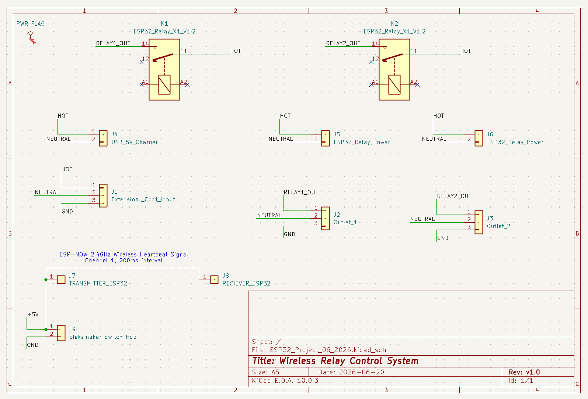

# ESP32 Wireless Relay Control System

A wireless relay control system built with two ESP32 microcontrollers 
communicating over ESP-NOW. The transmitter sends a continuous heartbeat 
signal, and as long as the receiver detects it within the timeout window, 
the relay stays closed and the connected device stays powered. Lose the 
signal and the relay opens automatically.

## How It Works

- Transmitter sends a single-byte heartbeat packet every **200ms** over ESP-NOW
- Receiver holds the relay closed as long as a heartbeat arrives within **800ms**
- Timeout window is 4x the transmit interval for interference tolerance
- No WiFi network required — ESP-NOW is fully peer-to-peer

## Hardware

- 2x AITRIP ESP32 Dev Boards (transmitters)
- 2x ESP32 Single Relay Module X1 V1.2 (receivers)
- Otdorpatio ABS Project Box
- BN-LINK 10ft 16 AWG Extension Cord
- 2-port USB Wall Charger (5V)
- Eleksmaker Switch Hub
- Dual outlet (jumper removed for independent switching)

**Rated load capacity: 1,200W (10A @ 120V AC)**

## Schematic

## Project Structure
esp32-wireless-relay-control/

├── transmitter/

│   ├── transmitter.cpp

│   └── platformio.ini

├── receiver/

│   ├── receiver.cpp

│   └── platformio.ini

└── schematic.png

## Setup

1. Open the `transmitter` or `receiver` folder as a PlatformIO project
2. Update `upload_port` and `monitor_port` in `platformio.ini` to match 
   your COM port
3. Update `relayMacAddress` in `transmitter.cpp` with your receiver's MAC 
   address
4. Flash transmitter code to the transmitter ESP32
5. Flash receiver code to the ESP32 on the relay module

## Notes

- Both devices must be on **ESP-NOW Channel 1**
- The receiver relay pin is **GPIO 16**
- The receiver starts with the relay OFF by default until a heartbeat is received
